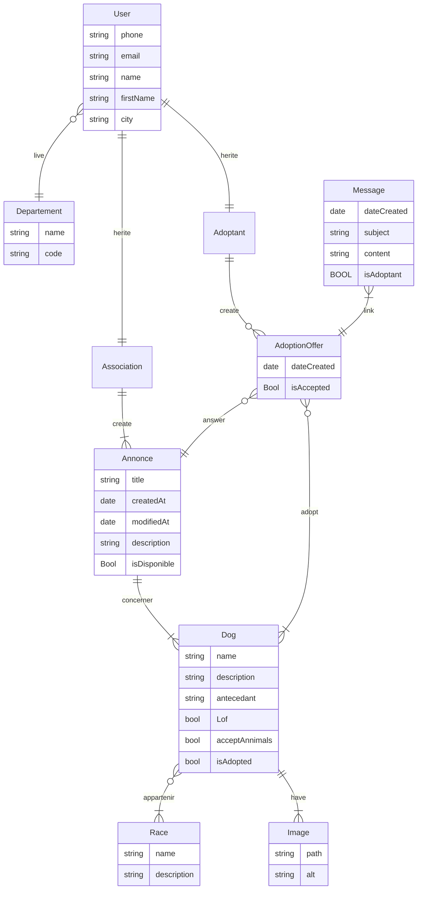

Nous allons mettre en place un projet Symfony, rendu sur Github/Gitlab, en utilisant des tickets (outil à définir). Le processus de travail doit être comme suit :

-   utiliser Git pour enregistrer les modifications de chaque développeur
-   une branche doit être créée pour chaque ticket de code
    -   lorsque le ticket est terminé, une Pull/Merge Request (appelée MR par la suite) doit être créée
    -   cette MR doit être relue par un autre développeur pour :
        -   remonter des incohérences
        -   vérifier que le code écrit répond à la demande
        -   vérifier que le code écrit correspond aux normes de codage défini au sein de l'équipe (et peut permettre de les définir)

Ce projet est prévu pour une équipe de 3 à 4 personnes.

## La demande client

Nous avons reçu la demande d'un client et notre équipe commerciale a décidé d'accepter le projet. Il convient maintenant de répartir le travail au sein de votre équipe et de le réaliser. Il doit être mis en place avec le framework Symfony et le design est à votre convenance, mais doit rester au plus simple.

Le client est une association d'éleveurs, qui travaillent également avec les SPA de la région. Ils souhaitent un site commun pour présenter les chiens et chiots à l'adoption.

Le site sera partagé en plusieurs espaces :

-   "Adoptant", pour permettre de consulter et de répondre à une annonce
-   "Mon compte annonceur" qui permettra aux éleveurs et aux SPA de poster et gérer leurs annonces, de modifier leurs informations, etc.
-   "Mon compte adoptant" qui permettra aux adoptants de gérer leurs demandes et leurs informations
-   Administration, utilisable uniquement par des administrateurs (une ou deux personnes)

Une API **publique** sera également à ajouter, pour permettre de récupérer des données du site dans des applications. Dans cette API, on veut seulement lire les données suivantes :

-   Liste des annonces
-   Détails d'une annonce (avec toutes les informations sur le chien, la race, etc.)
-   Liste des chiens
-   Détails des chiens
-   Liste des races avec les chiens associés

## Partie "adoptant"

Ici, nous appelons "adoptant" tout visiteur du site souhaitant adopter un ou plusieurs chiens présentés sur le site. Ils doivent pouvoir :

-   voir toutes les annonces
-   consulter une annonce
-   créer un compte (obligatoire pour répondre à une annonce)
-   envoyer une demande à une annonce ("je veux adopter ce(s) chien(s)")
-   être notifié (sur le site) et lire les réponses des éleveurs/SPA et échanger avec ces derniers (fil de discussion)

### Page d'accueil

La page d'accueil permettra de voir rapidement l'actualité du site (dernières annonces) et de présenter les éleveurs et SPA présentes sur le site (liens vers fiches de présentation).

Ces éléments seront répartis en 2 blocs :

-   une liste contenant les 5 dernières annonces (encore à pourvoir), chaque annonce devant présenter :
    -   les 3 premières photos de l'annonce
    -   le titre de l'annonce
    -   le nombre de chiens concernés
    -   les races des chiens concernés
    -   la date de mise à jour de l'annonce
-   Une liste exhaustive des éleveurs et des SPA présentes sur le site. Elles devront être présentées en fonction des dernières annonces mises à jour (plus l'association/SPA a mis à jour une annonce récemment, plus elle apparait haut dans la liste). Chaque élément doit présenter :
    -   Le nom de l'association/SPA
    -   Le nombre d'annonces actuellement à pourvoir de cette association/SPA
    -   Le nombre d'annonces pourvues de cette association/SPA

### Liste de toutes les annonces

Cette liste présente toutes les annonces à pourvoir présentes sur le site (dont au moins un chien n'a pas été adopté). Chaque annonce devant présenter :

-   les 3 premières photos de l'annonce
-   le titre de l'annonce
-   le nombre de chiens concernés
-   les races des chiens concernés
-   la date de mise à jour de l'annonce

Vous devez aussi pouvoir filtrer cette liste par :

-   races
-   contenant au moins un chien LOF

### Page annonce

Une page d'annonce doit comporter les éléments suivants :

-   Le titre de l'annonce
-   des informations sur les différents chiens adoptables. Pour chacun d'entre eux, peuvent être présents :
    -   son nom
    -   sa ou ses races (au moins une, et prévoir "inconnue" pour les chiens croisés)
    -   ses antécédents (texte descriptif de son passé)
    -   s'il est LOF ou non (chien de race homologué)
    -   une description complète (texte descriptif du chien et de son comportement)
    -   s'il accepte les autres animaux
    -   une à 5 images
-   Un lien permettant de répondre à l'annonce (voir partie "Répondre à l'annonce")

⚠️ un chien de l'annonce peut être adopté, mais pas tous. Seuls les chiens non adoptés peuvent faire l'objet d'une demande d'adoption.

### Répondre à l'annonce

Pour accéder à cette page, l'adoptant doit avoir un compte et doit être connecté. Il doit pouvoir :

-   remplir un formulaire lui permettant de :
    -   choisir le ou les chiens de l'annonce qu'il souhaite adopter (ou obtenir des informations)
    -   entrer ses coordonnées de contact (email, téléphone, ville et département de résidence, nom, prénom, etc.)
    -   Un message (minimum 200 caractères, maximum 12 000) à destination de l'association/SPA lié à l'annonce

⚠️ un chien de l'annonce peut être adopté, mais pas tous. Seuls les chiens non adoptés peuvent faire l'objet d'une demande d'adoption.

### Inscription

Pour accéder à cette page, l'adoptant ne doit pas être connecté et ne doit pas avoir de compte.

Le formulaire d'inscription demande uniquement un email et un mot de passe. Dès la demande effectuée, l'adoptant doit être connecté et pouvoir se servir de son compte.

### Mon compte

En tant qu'adoptant (ayant un compte et étant connecté), il dispose d'une section où il peut suivre les demandes d'adoption déposées. Pour chacune d'entre elles, il doit pouvoir :

-   avoir une fiche récapitulative du ou des chiens concernés
-   accéder à un fil de discussion, contenant son message et les éventuelles réponses de l'association/SPA (⚠️ un adoptant ne peut plus envoyer de message après son premier contact, tant que l'association/SPA ne lui a pas répondu au moins une fois)
-   modifier ses informations personnelles (qui permettront de remplir plus rapidement le formulaire d'adoption)

## Partie "annonceur"

Si je suis connecté en tant qu'association/SPA (autrement appelé annonceur par la suite), j'ai accès à une section me permettant de gérer mes annonces, répondre à des discussions, etc.

### Gestion des annonces

Je dispose d'une interface pour :

-   voir la liste de mes annonces et avoir des liens pour :
    -   accéder à un formulaire pour la modifier
    -   accéder à l'annonce (dans un nouvel onglet) (page de la partie "adoptant")
    -   marquer l'un des chiens de l'annonce comme adopté (lorsque tous les chiens de l'annonce sont adoptés, l'annonce est pourvue)
-   voir les derniers messages reçus et non répondus, groupés par annonce et adoptant, et accéder aux fils de discussion

### Modifier une annonce

Ce formulaire permet de modifier **toutes** les informations d'une annonce (à l'exception du fil de discussion).

## Partie "administrateur"

Si je suis connecté en tant qu'administrateur, j'ai accès à une section me permettant d'avoir des statistiques et de gérer certaines informations du site.

J'ai accès à plusieurs CRUD :

-   Utilisateurs (je peux créer/modifier les comptes du site)
-   Races de chiens
-   Associations/SPA

## Api

L'Api doit être publique (tout le monde peut y accéder) et ne doit donc pas afficher de données sensibles (mots de passe, identifiants, informations personnelles, etc.).

Une documentation (générée) doit être disponible et permettre de savoir ce que l'Api peut retourner et sous quel format.

Nous voulons des routes pour récupérer les éléments suivants :

-   Liste des annonces
-   Détails d'une annonce (avec toutes les informations sur le chien, la race, etc.)
-   Liste des chiens (il doit être possible de filtrer par chiens adoptés ou non)
-   Détails des chiens
-   Liste des races avec les chiens associés

## Améliorations

Le client aimerait également que l'équipe de développement soit force de proposition pour améliorer le site.

Pour cela, veuillez remplir le fichier `README.md` et créer une liste des améliorations que vous imaginez.

## Critères d'acceptation (notation)

Pour valider le rendu, voici ce qui est attendu par votre chef de projet, pour chacun d'entre vous :

-   Création/manipulation d'au moins une entité (CRUD, requête _via_ un repository, etc.)
-   Création de routes et de controllers
-   Création de vues Twig (avec utilisation d'héritage)
-   Mise en place d'au moins un formulaire
-   Création de services
-   Chaque PR est reliée à un ticket (GitHub Project, Trello ou autre outil équivalent)
-   Chaque ticket fait l'objet d'une PR relue et approuvée
-   Intégrer un bundle

Bonus :

-   Respect des normes PSR et des conventions définies par le groupe pour tout le code

Éléments communs à fournir :

-   Un diagramme de classe / schéma de la BdD
-   Un plan du site (liste des pages et les liens entre elles)
-   Un document avec les normes de nommage et de rangement de vos fichiers

# Mcd

